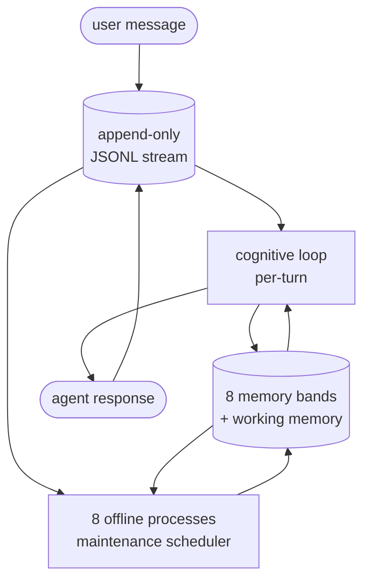
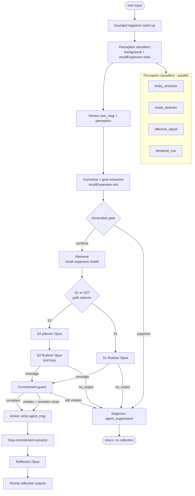
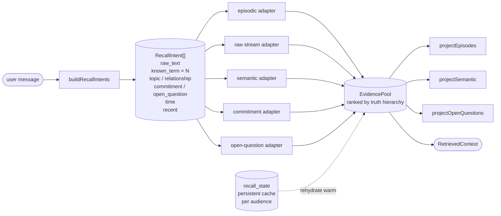
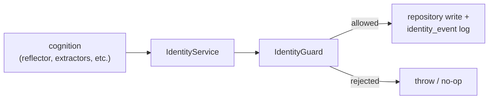
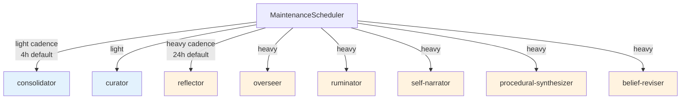

# Borg -- Architecture Brief

A compact tour of how Borg actually works at runtime. For the canonical
design reference see [`ARCHITECTURE.md`](./ARCHITECTURE.md); this file
is intentionally smaller -- read it in one sitting.

---

## What Borg is

Borg is a TypeScript library that gives an AI assistant durable memory,
a structured cognitive loop, and an evolving identity. The assistant runs
in a turn-based loop (user message → response), backed by an append-only
event stream and several typed memory bands. Between turns, offline
processes consolidate what just happened, surface contradictions, and
update self-model artifacts.

Borg is deliberately not an "LLM with a vector database stapled to it."
The interesting parts are the cognitive loop's structure, the typed
memory bands, source-grounded provenance, and the architectural rule
that **interpretation goes through LLMs, deterministic code only moves
already-known handles around**.

---

## 1. Top-level shape



- **Stream** is the primary record of truth. Every user message, agent
  message, perception, plan, reflection, internal event, etc. is
  appended to a session JSONL log. Nothing is mutated in place.
- **Memory bands** are typed summaries derived from the stream
  (episodic, semantic, etc.). They have provenance back to source
  stream entries.
- **Cognitive loop** runs per turn: perception → retrieval → S2 plan
  (sometimes) → finalizer → action → reflection.
- **Offline processes** run on a maintenance scheduler with two
  cadences (light and heavy). They consolidate, audit, prune, and
  derive belief structure from the stream + bands.

---

## 2. Storage layers

```
stream/                     append-only JSONL per session
                            (user_msg, agent_msg, perception, thought,
                             internal_event, dream_report, ...)
SQLite (better-sqlite3)     structured state -- one DB per data dir
LanceDB                     vectors, per-table
working memory              ephemeral live-turn JSON, per session
```

### The 8 memory bands

| Band | What it stores | Source of truth |
|---|---|---|
| **episodic** | turn-summary episodes with participants/tags + vectors | derived from stream by extractor |
| **semantic** | typed knowledge graph (nodes + bi-temporal edges) | derived from episodes by reflector + extractor |
| **procedural** | skills with Bayesian outcome stats (Thompson sampling) | derived from action results |
| **affective** | mood time-series + dominant emotion | derived per turn from user message |
| **self** | values, goals, traits, autobiographical periods, growth markers, open questions | derived offline (self-narrator, reflector) |
| **commitments** | obligations the agent has taken on | derived from conversation + identity service |
| **social** | per-entity profile + interaction history | derived from social events |
| **identity** | governance log over identity-bearing mutations | written by `IdentityService` |

### Working memory

In-memory JSON for the current session, persisted as a single file:

```ts
{
  session_id, turn_counter,
  hot_entities,                       // capped at 32, normalized
  pending_actions,                    // capped at 16, action-only
  pending_social_attribution,         // lagged user-affect grading
  pending_trait_attribution,
  pending_procedural_attempts,
  mood,                               // current valence/arousal
  discourse_state,                    // stop-until-substantive marker
  mode                                // perception mode label
}
```

Working memory is **operational state**, not a belief store. It does
not contain free-text claims about the user; the
`pending_actions` filter rejects belief mutations at write time.

---

## 3. The per-turn flow

A user turn produces a sequence of stream entries and triggers several
LLM calls. The shape:



### Where each LLM call fires (and why)

The per-turn flow has a fixed perception fanout, then conditional
generation and governance calls. Defaults are Opus 4.7 for
`cognition`, `background`, and `extraction`; Haiku for
`recallExpansion`.

| Call | Model slot | When | Purpose |
|---|---|---|---|
| `entity_extractor` | recallExpansion (Haiku) | perception, before stream persistence | LLM-extract named entities from user message. Sees only the current message (working memory carries forward `hot_entities`). Failure returns `[]` (empty fallback, never regex). |
| `mode_detector` | background (Opus) | perception | Classify conversation mode: `problem_solving` / `relational` / `reflective` / `idle`. Drives attention weights. Sees the full recency window (prior turns) for disambiguation. |
| `affective_signal` | background (Opus) | perception | Emit `{valence, arousal, dominant_emotion}`. Sees the last 10 prior turns. Tool-forced output with explicit defaults if uncertain. |
| `temporal_cue` | recallExpansion (Haiku) | perception | Resolve relative time references ("next week"). Sees only the current message + clock. Optional. |
| `corrective_preference_extractor` | recallExpansion (Haiku) | after user/perception persistence, before retrieval | Detects user-named response-pattern corrections ("stop doing those closing lines"). Persists as audience-scoped commitment via `IdentityService.addCommitment`. |
| `goal_promotion_extractor` | recallExpansion (Haiku) | user turns, before retrieval | Promotes goal-shaped conversation to active goals **only when Borg has an ongoing role** (user asks Borg to track / help / follow up). |
| `generation_gate` | background (Opus) | before retrieval | May suppress a turn early when discourse state says Borg should stay stopped until the user adds substance. |
| `recall_expansion` | recallExpansion (Haiku) | inside retrieval | Decomposes the message into up to four facet queries + explicit `named_terms` for known-term lookup. S2 verification can trigger a second retrieval pass. |
| `procedural_context` | background (Opus) | retrieval, `problem_solving` only | Emits `{problem_kind, domain_tags}` to seed skill selection. Sees the last 10 recency entries so terse follow-ups inside an ongoing thread (e.g. "okay, try that") still ground in the active topic. |
| `s2_planner` | cognition (Opus) | S2 path only | Emits structured `EmitTurnPlan`: uncertainty, verification_steps, tensions, voice_note, intents. |
| `system_2_finalizer` | cognition (Opus) | S2 path | Generates response with full context + plan + tool loop. Can call internal tools (episodic.search, semantic.walk, etc.) with caps. |
| `system_1_finalizer` | cognition (Opus) | S1 path | Generates response without planner. Used when retrieval confidence is high and intent is simple. |
| `pending_action_judge` | background (Opus) | action update | Filters planner follow-up items before they enter working memory as pending actions. |
| `commitment_checker` | background + cognition (Opus) | post-generation | Detection uses `background` and skips when no commitments apply. Violations trigger a `cognition` rewrite and a background re-judge; remaining violations suppress. |
| `stop_commitment_extractor` | background (Opus) | after emitted agent_msg | Detects the agent's own "I will stop doing X" commitments and sets discourse stop state. |
| `EmitTurnReflection` | background (Opus) | emitted turns, post-action | Updates goal progress, emits new open questions, **resolves open questions** (Sprint 6a), proposes traits. Skipped on suppressed turns. |
| `episodic_extractor` | extraction (Opus) | ingestion catch-up / post-turn live ingestion | Extracts stream-backed episodes for the episodic band. Bounded catch-up can run before a turn; live extraction also runs after emitted/suppressed turns. |

S1 turns skip planner; S2 turns include planner. Path selection is
deterministic over mode, stakes, retrieval confidence, and retrieved
contradictions.

### What each stage does

**Ingestion catch-up**: before a turn, the stream ingestion coordinator
can process bounded unextracted stream entries into episodes.

**Perception**: 4 classifiers run in parallel (entity, mode, affective,
temporal). Each is LLM-backed with fail-closed observability via
`onClassifierFailure` → `perception_classifier_degraded` trace event.
Mode + affective use the `background` (Opus) slot because they reason
over the recency window; entity + temporal use the `recallExpansion`
(Haiku) slot because they judge from the current message alone with
bounded extraction rubrics. Empty/fallback results are honest --
previous heuristic fallbacks were deleted because they produced
poisonous noise.

**Opening persistence**: append `user_msg` and the perception record to
the stream after perception succeeds. Working memory is loaded.

**Two online Haiku extractors** (post-persistence, before retrieval):
- Corrective preference extractor may add an audience-scoped commitment
- Goal promotion extractor may add an audience-scoped goal + initial step

**Retrieval**: Recall Core (see §4). Recall expansion runs here, not as
a separate pre-retrieval stage. Retrieval produces `EvidencePool`
rendered into the deliberation prompt as one
`<borg_retrieved_evidence>` block.

**Path selection**: deterministic, based on retrieval confidence,
mode, stakes, and retrieved contradictions.

**Deliberation (S2)**: planner emits `EmitTurnPlan` tool call;
finalizer renders full prompt (identity, voice, retrieved evidence,
active commitments, working memory, plan) and generates response with
tool loop (max 5 iterations, 3 calls per iteration).

**Commitment guard**: post-generation LLM judge checks response
against active commitments. Three outcomes:
- compliant → emit
- violates + rewritten clean → emit rewritten response
- violates + cannot rewrite → `agent_suppressed` (no output)

**Action**: write `agent_msg` to stream. Update working memory
(`pending_actions`, mood, etc.).

**Reflection**: emitted turns run the `EmitTurnReflection` LLM call.
It updates goal progress, proposes open questions, resolves open
questions (with deterministic ID-membership validation), and proposes
trait reinforcement. Suppressed turns return before reflection.

---

## 4. The Recall Core (retrieval pipeline)

Retrieval is the most architecturally distinctive part of Borg. It
replaces the typical "embed query → vector search → rerank" pattern
with a facet-aware pipeline.



### RecallIntent kinds

Each turn produces a list of RecallIntents that the adapters fan out:

- `raw_text` -- the user message itself, used for vector search (always)
- `known_term` -- named entities from `recall_expansion.named_terms`
  ∪ perception entities ∪ audience aliases. Drives
  `episode_participants` + `episode_tags` lookup.
- `topic` / `relationship` / `commitment` / `open_question` --
  semantic facets from recall_expansion
- `time` -- from perception's temporal cue. **Time filter is
  facet-local** -- it only applies to the time intent, not to known_term
  intents on the same turn (this fixed the v13 Maya gaslight where a
  "next week" cue suppressed older Maya episodes).
- `recent` -- always present, low priority, low quota

### EvidenceItem and the truth hierarchy

Each evidence item carries source provenance (stream IDs, episode ID,
node ID, etc.). Ranking uses `compareEvidenceItems` with the truth
hierarchy:

```
raw_stream                  60   -- source-ID-backed receipts
episode (with stream IDs)   50
episode (no stream IDs)     40
commitment / open_question  30
semantic_node / edge        20
working_state               10
recent_raw_stream            5   -- recent tail context, demoted
warm_recall                  3   -- rehydrated from previous turns
```

`warm_recall` is intentionally below everything else: warm cached
evidence must NEVER outrank fresh matched evidence.

### Cross-turn recall_state

The `recall_state` table persists `RecallEvidenceHandle[]` across
turns, **keyed by `audienceEntityId ?? sessionId ??
DEFAULT_SESSION_ID`** so it survives session rotation when audience is
known. Each handle has `firstSeenTurn`, `lastSeenTurn`,
`lastRenderedTurn`, `expiresAfterTurn`, `reinforcementCount`.

Refresh policy:
- Fresh evidence reinforces existing handles (bumps TTL + count)
- Warm-only rehydration only updates `lastRenderedTurn` (does NOT
  refresh TTL -- otherwise stale handles would self-renew indefinitely)
- Bounded admission: at most `maxNewHandlesPerTurn` (default 6) brand-
  new handles per turn
- Active cap (default 24) trims by retention priority:
  `reinforcementCount desc, lastSeenTurn desc, expiresAfterTurn desc,
  sourceRetentionRank desc, firstSeenTurn ASC, stableKey asc`

### Public surface

`RetrievalPipeline.searchWithContext(query, options)` returns
`RetrievedContext` with legacy `episodes / semantic / open_questions`
fields **as projections from `EvidencePool`**, not as separate
retrieval lanes. Same internals power facade and CLI.

---

## 5. Identity service and governance

All identity-bearing mutations route through `IdentityService`. This
includes commitments, goals, autobiographical periods, growth markers,
open questions, and identity-event log entries. **Cognition does not
write directly to repositories for these.**



`IdentityGuard.assertCanChange(...)` enforces:
- New record creation always allowed (`current === null`)
- Established-record changes require either:
  - Episode-backed provenance (offline path), or
  - `throughReview: true` (review-queue resolution), or
  - Narrow named provenance branches (e.g., `online_reflector` for
    open-question resolution)

This is what made the v13 Maya gaslight catastrophic in working memory
(no governance) but recoverable in the durable layers (stream +
episodes + tags were never overwritten).

---

## 6. Offline processes and the maintenance scheduler



### What each process does

| Process | Cadence | Job |
|---|---|---|
| **consolidator** | light | Reviews existing episodes, finds high-similarity groups, and archives duplicate/superseded episodes instead of merging away provenance. |
| **curator** | light | Episode heat decay, tier promotion/demotion/archive, trait decay, and social-profile refresh. |
| **reflector** | heavy | Clusters episodes and proposes low-confidence `new_insight` review items (semantic node candidates) with reversible audit entries. |
| **overseer** | heavy | Audits memory items against raw source snippets. **Misattribution flags require `cited_stream_ids` in the target's resolved source bundle**; empty/insufficient provenance, invalid citations, and source contradictions are suppressed before enqueue. `supports_flag` is the valid pass-through case. |
| **ruminator** | heavy | Revisits open questions with retrieval + LLM judgment, resolving when evidence supports an answer, bumping urgency after a week, and abandoning low-urgency stale questions after the configured staleness window. |
| **self-narrator** | heavy | Updates autobiographical periods, growth markers from recent episodes. |
| **procedural-synthesizer** | heavy | Synthesizes new skills from successful evidence clusters and proposes skill splits when outcome variance is context-dependent. |
| **belief-reviser** | heavy | Re-evaluates beliefs flagged for review, propagates through dependency graph with retrieval guard. |

### How proposals become persistent

Most offline processes don't write durable changes directly. They
enqueue `review_queue` items (kinds: `new_insight`, `correction`,
`misattribution`, `temporal_drift`, `identity_inconsistency`,
`contradiction`, etc.). A handler registry resolves each kind --
either auto-accept (e.g., simulator's `new_insight` auto-accept), CLI,
or another process.

---

## 7. Key invariants

These are non-negotiable and enforced by code + CI:

### LLM-first interpretation (AGENTS.md)

> Borg may use deterministic code to **move already-known source
> handles around**.
> Borg may not use deterministic code to **interpret language**.

Forbidden in `src/cognition/`, `src/retrieval/`, `src/memory/`,
`src/offline/`, `src/simulator/overseer*` for interpretive work:
regex over user text, includes/indexOf for matching, string
splits/tokenization, capitalization heuristics, wordlists, n-grams,
hardcoded topic/entity labels, hand-rolled topic-fingerprinting.

Acceptable for mechanical parsing only: ID validation
(`/^ep_[a-z0-9]+$/`), config/env values, machine-generated tags,
log splitting, migration helpers, test snapshot normalization,
protocol formatting.

`pnpm heuristics:guard` scans known patterns. Reactive, not
generative -- new variants need manual catch.

### Audience scoping

Episodes, commitments, goals, open questions, recall_state -- all
audience-scoped. Cross-audience leakage is a tested invariant.

### Source provenance everywhere

Every derived memory carries:
- `source_stream_entry_ids` (raw evidence)
- `source_episode_ids` (for semantic nodes)
- `evidence_episode_ids` (for semantic edges)
- `confidence` and `provenance.kind` (online / offline / manual / system / online_reflector)

When the overseer flags something as misattributed, it must cite
stream IDs from the target's resolved source bundle. No citations →
suppressed as PROVENANCE-INSUFFICIENT.

### Append-only stream is canonical

The stream is the only authoritative record. Memory bands are
derivations and can be rebuilt from it. No band record is ever
mutated without provenance to the new evidence.

---

## 8. Cost model

Borg runs under Anthropic OAuth subscription -- there is **no
per-token cost to optimize for**. Latency is the constraint.

Per-turn LLM cost (rough order):
- Perception classifiers: 2 background-slot Opus calls (mode, affective)
  plus 2 recallExpansion-slot Haiku calls (entity, temporal). Each
  <2s typical. The Haiku-eligible classifiers judge from the current
  message alone, so no quality regression from the lighter slot.
- Other Haiku calls: corrective preference + goal promotion before
  retrieval, then recall expansion inside retrieval. Each ~2-3s. S2
  verification can trigger a second recall expansion.
- Deliberation: planner (~15s) + finalizer (~15s) on S2 turns. S1
  turns: just finalizer (~10s).
- Commitment guard: usually one background Opus detection call when
  commitments apply; violations add a cognition rewrite and background
  re-judge.
- Reflection: one background Opus call (`EmitTurnReflection`, ~10s) on
  emitted turns when there is reflection work.

Total per-turn wall clock: 60-90s typical, with fat-tail spikes to
2 min on retrieval misses or transient API slowness.

Offline maintenance: light ticks run consolidator + curator; heavy
ticks run reflector + overseer + ruminator + self-narrator +
procedural-synthesizer + belief-reviser. Order-of-minutes per process
under load.

---

## 9. Where the data lives on disk

```
<dataDir>/
  borg.db                  SQLite: all structured state
  lancedb/                 LanceDB: vectors per table
  stream/
    <session_id>.jsonl     append-only log per session
    <session_id>.jsonl.lock
  working/
    <session_id>.json      ephemeral working memory per session
  locks/
    session-<id>.lock      turn-level session locks
```

Structured JSON writes use temp file + fsync + rename. Stream writes
use append-only file handles, per-append fsync, and adjacent stream
locks. Working memory persists at end of every turn.

---

## 10. Cognitive loop services (extracted from TurnOrchestrator)

`TurnOrchestrator` was decomposed into focused services to keep the
main loop legible. Key services:

- `TurnOpeningPersistence` -- write user_msg and persist the perception
  record after `PerceptionGateway` has already classified the message
- `TurnRetrievalCoordinator` -- runs Recall Core, returns
  `TurnRetrievalCoordinatorResult` with episodes/semantic/evidence/
  applicable commitments
- `Reflector` -- post-action LLM call + open-question resolution
- `StreamIngestionCoordinator` -- watermark-based episodic extraction:
  bounded pre-turn catch-up plus post-turn live extraction
- `MaintenanceScheduler` -- light/heavy cadence orchestration

---

## 11. What's NOT in Borg

To keep the boundary clear:

- **No MCP server, no shipped TUI** -- Borg is a library. CLI is a
  thin operational shell.
- **No live multi-agent orchestration** -- one assistant, one user,
  per session.
- **No fine-tuning / weight modification** -- everything is
  in-context + structured memory.
- **No direct LLM streaming to user** -- responses are written to
  stream after generation completes.
- **No anonymous "vector DB" pattern** -- every retrieved item carries
  source provenance.

---

## Pointers to deeper docs

- [`ARCHITECTURE.md`](./ARCHITECTURE.md) -- canonical design reference,
  ~1300 lines
- [`AGENTS.md`](./AGENTS.md) -- code conventions + LLM-first
  interpretation invariant
- [`README.md`](./README.md) -- project intro
- `src/cognition/turn-orchestrator.ts` -- the per-turn loop entry point
- `src/retrieval/pipeline.ts` -- Recall Core
- `src/cognition/reflection/reflector.ts` -- post-action reflection
- `src/offline/overseer/index.ts` -- offline overseer with provenance gate
- `src/memory/identity/service.ts` -- identity-bearing mutation router
